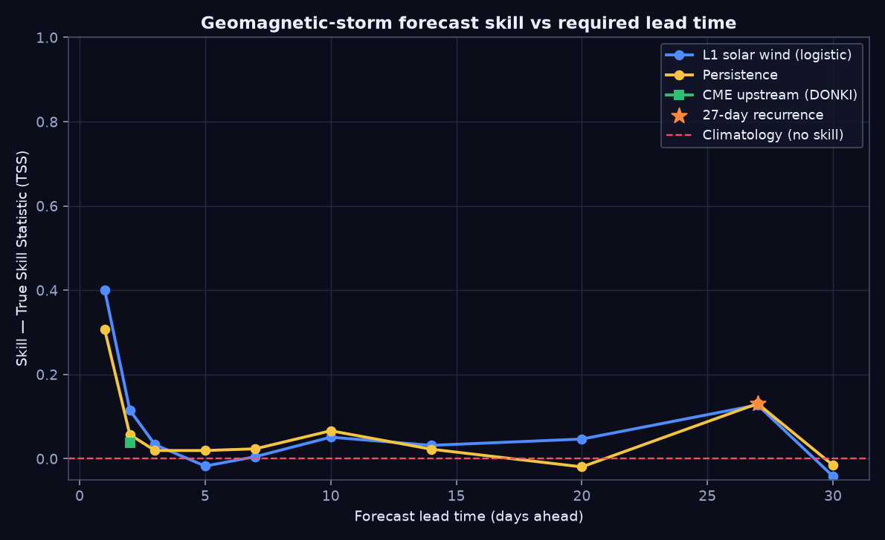

# Lead-time vs skill — geomagnetic storm forecasting

*Target:* daily peak Kp >= 5 (G1+ storm)  
*Protocol:* chronological train/test split with gap; thresholds fit on train, scored on test  
*Test set:* 1314 days, storm-day base rate 13.2%  ·  *seed:* 42

## Headline TSS by method and lead

| Method | Lead (days) | TSS | Recall | Precision |
|---|---:|---:|---:|---:|
| persistence | 1 | 0.306 | 0.67 | 0.22 |
| l1_solar_wind | 1 | 0.400 | 0.67 | 0.28 |
| persistence | 2 | 0.057 | 0.29 | 0.16 |
| l1_solar_wind | 2 | 0.115 | 0.70 | 0.15 |
| persistence | 3 | 0.019 | 0.83 | 0.14 |
| l1_solar_wind | 3 | 0.033 | 0.39 | 0.14 |
| persistence | 5 | 0.019 | 0.83 | 0.14 |
| l1_solar_wind | 5 | -0.018 | 0.27 | 0.13 |
| persistence | 7 | 0.023 | 0.74 | 0.14 |
| l1_solar_wind | 7 | 0.005 | 0.48 | 0.13 |
| persistence | 10 | 0.066 | 0.66 | 0.15 |
| l1_solar_wind | 10 | 0.051 | 0.51 | 0.14 |
| persistence | 14 | 0.022 | 0.74 | 0.14 |
| l1_solar_wind | 14 | 0.032 | 0.50 | 0.14 |
| persistence | 20 | -0.020 | 0.80 | 0.13 |
| l1_solar_wind | 20 | 0.046 | 0.83 | 0.14 |
| persistence | 27 | 0.131 | 0.44 | 0.18 |
| l1_solar_wind | 27 | 0.127 | 0.48 | 0.17 |
| persistence | 30 | -0.016 | 0.87 | 0.13 |
| l1_solar_wind | 30 | -0.042 | 0.66 | 0.13 |
| recurrence_27d | 27 | 0.131 | 0.44 | 0.18 |
| climatology | — | 0.000 | — | — |
| cme_donki | 2 | 0.038 | 0.43 | 0.14 |

## What the figure shows

- **Skill decays with lead time.** Both persistence and the L1 solar-wind model are most skilful at the shortest leads and fall toward the climatology (zero-skill) line as the horizon grows.
- **L1 beats persistence at short lead** (best L1 TSS 0.40 at 1d vs persistence 0.31 at 1d) — measuring the upstream solar wind adds genuine skill over 'tomorrow = today'.
- **A 27-day recurrence bump** (TSS 0.13) appears at one solar rotation — recurrent coronal-hole streams give weak but real long-lead skill that smoothly-decaying persistence misses.
- **CMEs extend useful lead to 1-3 days** (best TSS 0.04 at 2d): a fast Earth-directed CME flags a storm days before its solar wind reaches L1.

**Takeaway:** no single vantage point forecasts storms well at every lead time. Short-lead skill comes from L1; the 1-3 day horizon needs CME observations; and only the weak 27-day recurrence offers anything further out. An honest operational system must combine vantage points by lead.
